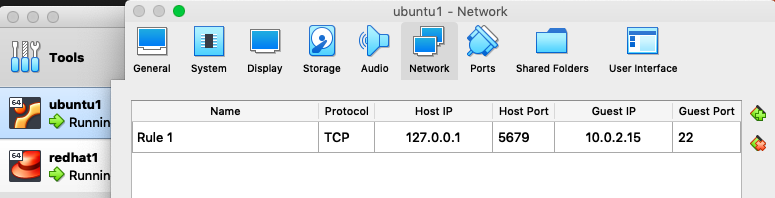

# Lab1 - SSH to guest from host

1. Create an Ubuntu VM in VirtualBox

2. In the Ubuntu VM guest machine, go to Settings:

    * Go to Network:
        * Go to `Adapter 1` and add port forwarding:
            * Attached to: NAT
            * Advanced > Port Forwarding
        
            

        * Go to `Adapter 2` and add a new adapter:
            * Attached to: Host-only Adapter
            * Name: vboxnet0

    * Go to System:
        * Enable I/O APIC

3. Start the Ubuntu VM guest, get the guest IP address,

    ```console
    $ ip addr show
    ...
    3: enp0s8: ...
    inet 192.168.99.101 brd 192.168.99.255 ...
    ...
    ```

4. On your host, get the host IP address,
    * on Mac, use `ifcongif`,

    ```console
    $ ifconfig
    en0: ...
    ...
    inet 192.168.1.3 ...
    ...
    vboxnet0: ...
	...
	inet 192.168.99.101 netmask 0xffffff00 broadcast 192.168.99.255
    ...
    ```

5. Go to VirtualBox > File > Host Network Manager

    * Make sure the local host IP has the same IP address as the Ubuntu VM guest, if not select `Configure the Adapter Manually` and set the `IPv4 Address` to the IP address of the Ubuntu VM guest,

6. Open a terminal on the host, and ssh in to the guest,

    ```console
    $ ssh user1@127.0.0.1 -p 5679 
    user1@127.0.0.1's password: ********
    Welcome to Ubuntu 18.04.2 LTS (GNU/Linux 4.18.0-15-generic x86_64)
    ...
    Last login: Sun Jul 28 22:00:21 2019 from 10.0.2.2
    user1@user1-VirtualBox:~$
    ```

    * To read more about VirtualBox networking and the VMs IP addresses, read [Oracle VM VirtualBox: Networking options and how-to manage them](https://blogs.oracle.com/scoter/networking-in-virtualbox-v2).
    * Exit the guest to return to the host terminal,

    ```console
    $ exit
    logout
    Connection to 127.0.0.1 closed.
    ```
    
7. Create SSH keys to authenticate SSH requests

